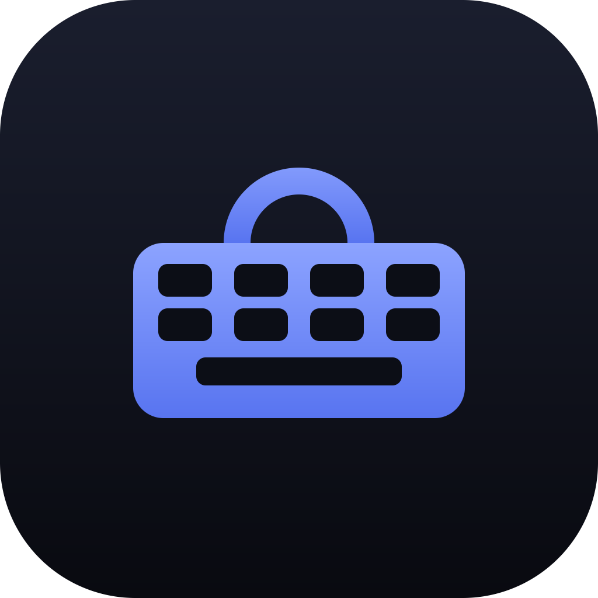
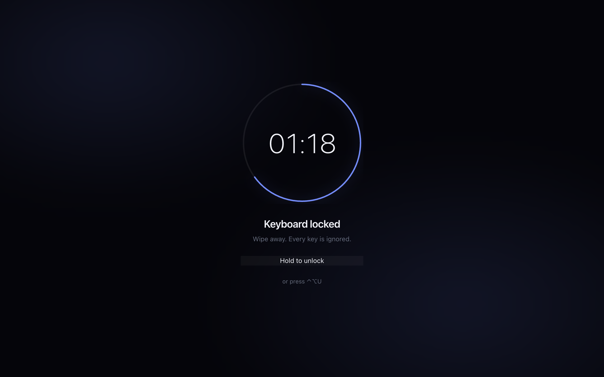
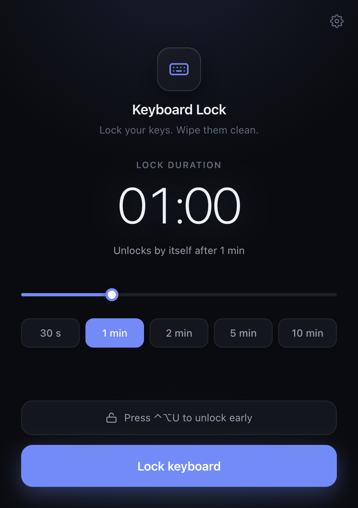
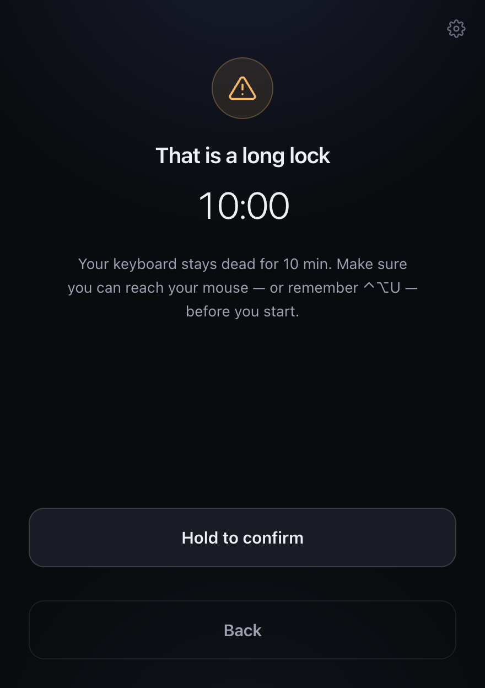
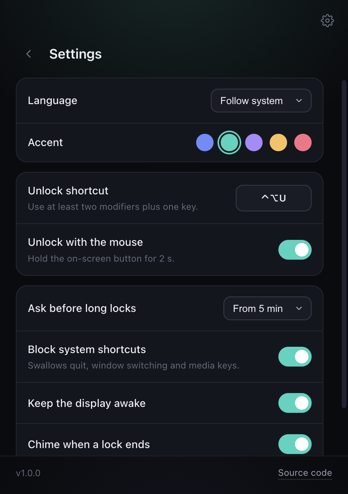
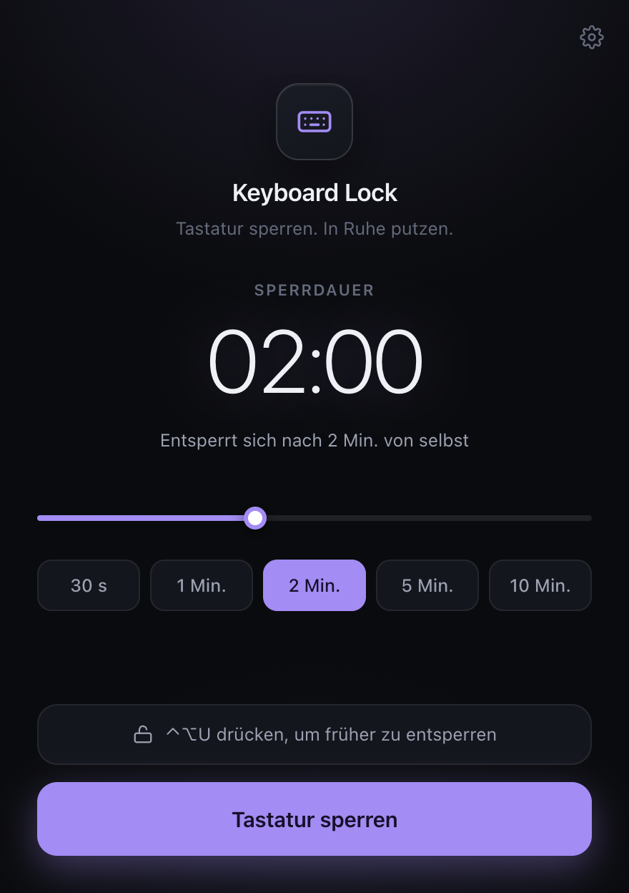
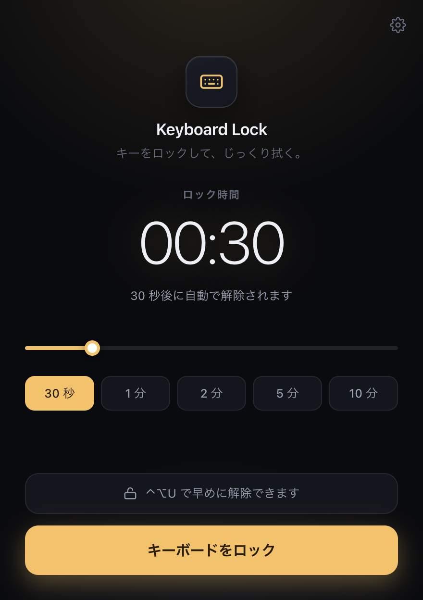

<div align="center">



# Keyboard Lock

**Lock your keys. Wipe them clean.**

A small, dark, cross-platform app that disables your keyboard for as long as you
ask it to — so you can actually clean a laptop keyboard without typing a page of
`jjjjjjj` into whatever was open.

[](https://github.com/sayedmahmod/keyboard-lock/actions/workflows/ci.yml)
[](https://github.com/sayedmahmod/keyboard-lock/releases/latest)
[](https://github.com/sayedmahmod/keyboard-lock/releases)
[](LICENSE)
[](#install)
[](#languages)

**English** · [Deutsch](README.de.md)

<a href="docs/screenshots/lock.png"></a>

</div>

---

## Why

Cleaning a keyboard is a two-minute job that every operating system makes
annoying. You wipe a laptop's keys and you have opened seventeen menus, renamed a
file, sent a half-written message and turned the volume to maximum.

Keyboard Lock covers your screens, swallows every keystroke for a duration you
choose, and gives your keyboard back automatically. Your mouse keeps working the
whole time, so you are never trapped.

## Features

- **Timed locks** from 10 seconds to an hour, with one-tap presets and a slider.
- **Three ways out**, always: the timer runs out, you press your unlock
  shortcut, or you hold the on-screen button with the mouse.
- **A second thought before long locks.** Anything at or above 5 minutes asks you
  to hold a button to confirm, and reminds you of the unlock shortcut first. The
  threshold is configurable, including off.
- **Every display covered.** Plug a monitor in mid-lock and it gets covered too.
- **Optional system-shortcut grabbing** so a stray swipe cannot quit an app,
  switch windows or change the volume.
- **12 languages**, following your system locale out of the box.
- **Dark by design**, with five accent colours.
- **Nothing to trust.** No network access, no runtime dependencies, no key
  logging, one settings file on disk. See [SECURITY.md](SECURITY.md).

## Install

Grab the build for your platform from the
**[latest release](https://github.com/sayedmahmod/keyboard-lock/releases/latest)**.

| Platform    | Download                                 | Notes                                     |
| ----------- | ---------------------------------------- | ----------------------------------------- |
| **macOS**   | `.dmg` (Apple Silicon and Intel)         | Also available as `.zip`                  |
| **Windows** | `.exe` installer, or the portable `.exe` | x64 and arm64                             |
| **Linux**   | `.AppImage`, `.deb` or `.rpm`            | `chmod +x` the AppImage before running it |

<details>
<summary><strong>The release builds are unsigned — here is how to open them anyway</strong></summary>

<br>

Code-signing certificates cost money per year, and this is a free app. The
builds come straight out of a public GitHub Actions run you can inspect, but
your OS does not know that.

**macOS** — right-click the app and choose _Open_, then _Open_ again in the
dialog. If macOS refuses outright:

```bash
xattr -dr com.apple.quarantine "/Applications/Keyboard Lock.app"
```

**Windows** — SmartScreen shows "Windows protected your PC". Click _More info_,
then _Run anyway_.

**Linux** — nothing special, just make the AppImage executable:

```bash
chmod +x Keyboard-Lock-*.AppImage
```

If you would rather not trust a binary at all, [build it yourself](#development)
— it takes one command.

</details>

## Using it

Pick a duration, press **Lock keyboard**, wipe. That is the whole app.

| Action                  | How                                                          |
| ----------------------- | ------------------------------------------------------------ |
| Start a lock            | Choose a duration, then **Lock keyboard**                    |
| Confirm a long lock     | Hold **Hold to confirm** for 2 seconds                       |
| Unlock early — keyboard | <kbd>Ctrl</kbd> + <kbd>Alt</kbd> + <kbd>U</kbd> (rebindable) |
| Unlock early — mouse    | Hold **Hold to unlock** for 1.5 seconds                      |
| Let it end by itself    | Do nothing; the ring runs out                                |

The unlock shortcut works on every keyboard layout, because it is matched
against the physical key position as well as the character it produces.

<table>
  <tr>
    <td width="33%" align="center">
      <a href="docs/screenshots/setup.png"></a>
      <br><sub><b>Pick a duration</b></sub>
    </td>
    <td width="33%" align="center">
      <a href="docs/screenshots/confirm.png"></a>
      <br><sub><b>Think twice about long locks</b></sub>
    </td>
    <td width="33%" align="center">
      <a href="docs/screenshots/settings.png"></a>
      <br><sub><b>Make it yours</b></sub>
    </td>
  </tr>
</table>

## How it works

The lock is built out of ordinary, reversible pieces — and that is a deliberate
design decision, not a shortcut:

1. A frameless, always-on-top window is placed over **every** display at the
   screen-saver window level, so it sits above the menu bar, the taskbar and
   other fullscreen apps.
2. The overlay takes keyboard focus and discards every key event before it
   reaches the page, so nothing you press goes anywhere. If another app steals
   focus, the overlay takes it back.
3. While the lock runs, the app asks the OS to reserve common system shortcuts
   (quit, window switching, media keys) so they do nothing either.
4. Your unlock combination is the one chord that is checked rather than
   discarded.

Nothing is installed into the input stack: no driver, no kernel extension, no
global OS hook, no accessibility permission. **The consequence is the important
part — there is no state to get stuck in.** Force-quit the app, log out, or pull
the power, and your keyboard is simply working again.

### What it does not do

Being honest about the edges matters more than a longer feature list:

- **A few shortcuts belong to the OS and cannot be taken.**
  <kbd>Ctrl</kbd>+<kbd>Alt</kbd>+<kbd>Del</kbd> on Windows, force-quit on macOS,
  and some compositor shortcuts on Linux will always work. That is a safety
  property of your operating system, and it is a good one.
- **Wayland limits what any app can grab.** On GNOME or KDE under Wayland the
  overlay still covers the screen and swallows keys sent to it, but reserving
  global shortcuts may quietly fail. The app tells you when that happens instead
  of pretending otherwise.
- **It does not disable the keyboard at the hardware level.** If you need the
  keys electrically dead — for a deep clean with liquid, say — power the machine
  off.
- **It is not a security lock.** It stops accidents, not people. Use your OS
  screen lock for that.

## Languages

The interface follows your system language, and you can override it in the
settings.

<table>
  <tr>
    <td width="50%" align="center">
      <a href="docs/screenshots/setup-de.png"></a>
      <br><sub><b>Deutsch</b></sub>
    </td>
    <td width="50%" align="center">
      <a href="docs/screenshots/setup-ja.png"></a>
      <br><sub><b>日本語</b></sub>
    </td>
  </tr>
</table>

English · Deutsch · Français · Español · Italiano · Português (BR) · Nederlands ·
Polski · Русский · Türkçe · 日本語 · 简体中文

Missing yours? [docs/TRANSLATING.md](docs/TRANSLATING.md) walks through adding
one — it is a single JSON file and two lines of registration.

## Settings

| Setting                | Default       | What it does                                                 |
| ---------------------- | ------------- | ------------------------------------------------------------ |
| Language               | Follow system | Overrides the detected locale                                |
| Accent                 | Indigo        | Five colours for the dark theme                              |
| Unlock shortcut        | `Ctrl+Alt+U`  | Needs at least two modifiers, so a cloth cannot hit it       |
| Ask before long locks  | From 5 min    | The hold-to-confirm step; can be set to 2/5/10/15 min or off |
| Unlock with the mouse  | On            | The hold-to-unlock button on the overlay                     |
| Block system shortcuts | On            | Reserves quit, window switching and media keys while locked  |
| Keep the display awake | On            | Stops the screen sleeping mid-lock                           |
| Chime when a lock ends | On            | A short synthesised two-note tone                            |

Settings live in one JSON file:

- macOS — `~/Library/Application Support/Keyboard Lock/settings.json`
- Windows — `%APPDATA%\Keyboard Lock\settings.json`
- Linux — `~/.config/Keyboard Lock/settings.json`

A corrupt or hand-edited file cannot lock you out: values are validated on read,
and an unusable unlock shortcut falls back to the default.

## Development

Node 20.19 or newer. No native modules, so no build toolchain to install.

```bash
git clone https://github.com/sayedmahmod/keyboard-lock.git
cd keyboard-lock
npm ci
npm run dev
```

```bash
npm test           # unit tests
npm run lint       # ESLint
npm run typecheck  # both TypeScript projects
npm run dist       # installers for your platform, into dist/
```

The app icon (`npm run icons`) and the screenshots in this README
(`npm run screenshots`) are both generated from source — the icon by a small
signed-distance-field rasteriser, the screenshots by capturing the real built UI.
Neither is a hand-drawn asset that can drift out of date.

```
src/
├── main/       Electron main process: windows, the lock, IPC, settings
├── preload/    The single, typed bridge exposed to the renderers
├── renderer/   Two windows — the setup card and the lock overlay
└── shared/     Pure logic: durations, accelerators, settings validation, i18n
```

`src/shared` imports neither Electron nor the DOM, which is what makes the parts
that matter — can this lock end, is this shortcut usable, is this duration sane —
testable in isolation.

## Contributing

Pull requests welcome. [CONTRIBUTING.md](CONTRIBUTING.md) has the setup, the
commands and the one rule that outranks everything else: **a user must always be
able to get their keyboard back.**

- Found a bug? [Open an issue](https://github.com/sayedmahmod/keyboard-lock/issues/new/choose)
- Security report? [SECURITY.md](SECURITY.md)
- Adding a language? [docs/TRANSLATING.md](docs/TRANSLATING.md)

## License

[MIT](LICENSE) © Keyboard Lock Contributors

<div align="center">
<br>
<sub>Built with <a href="https://www.electronjs.org/">Electron</a>, TypeScript and no runtime dependencies.</sub>
</div>
